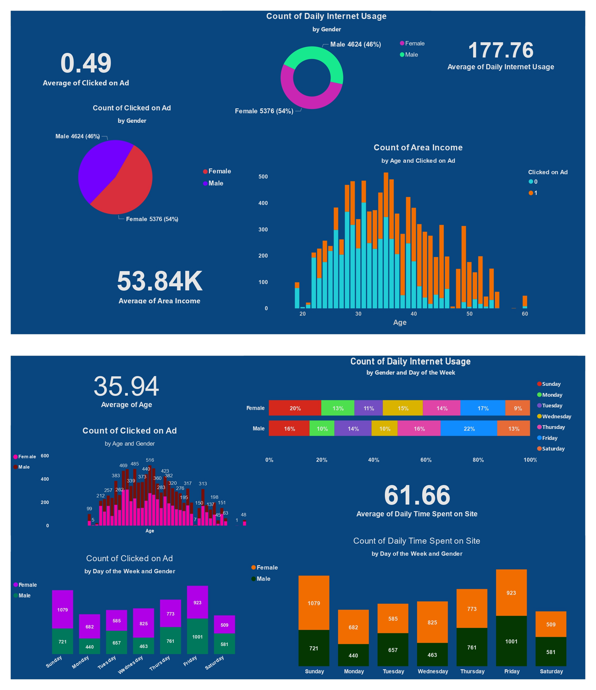

# Ads Click Through Rate Prediction

So this is how you can use Machine Learning for the task of Ads CTR prediction using Python. Ads CTR means predicting whether the user will click on the ad. In this task, we need to train a Machine Learning model to find relationships between the characteristics of all the users who click on ads.

Ads Click-through rate prediction means predicting whether the user will click on the ad. In the task of ads click-through rate prediction, we need to train a Machine Learning model to find relationships between the characteristics of all the users who click on ads

